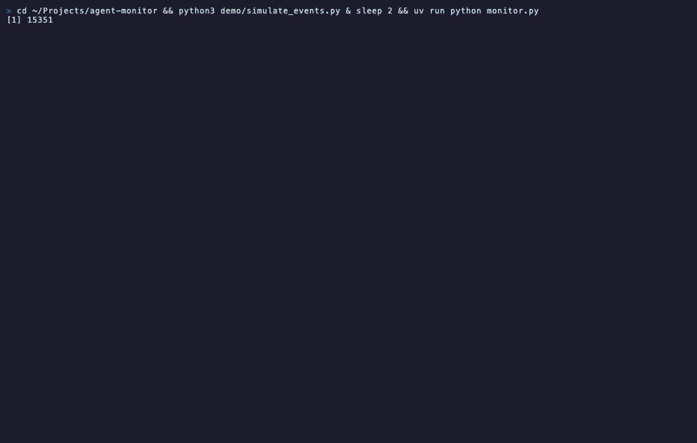

# Agent Monitor

A real-time TUI dashboard for monitoring [mcp-multi-model](https://github.com/K1vin1906/mcp-multi-model) MCP Server activity. Built with [Textual](https://textual.textualize.io/).

Watch your multi-model AI queries as they happen — streaming tokens, cost tracking, error states, and side-by-side comparison.



## Features

- **Real-time streaming** — See model responses arrive token by token (300ms buffered refresh)
- **Agent status cards** — Per-model call count, token usage, cost, and activity indicator with spinner animation
- **Dual view mode** — Unified log or side-by-side comparison (press `d` to toggle)
- **Event log** — Start, end, retry, and error events with timestamps
- **Settings panel** — View/edit API keys directly in the TUI (press `s`)
- **Auto-reconnect** — Automatically reconnects when MCP Server restarts
- **Dynamic config** — Reads model list from `config.yaml`, auto-assigns colors

## Installation

Requires Python 3.12+ and [uv](https://docs.astral.sh/uv/).

```bash
git clone https://github.com/K1vin1906/agent-monitor.git
cd agent-monitor
uv sync
```

## Usage

Make sure [mcp-multi-model](https://github.com/K1vin1906/mcp-multi-model) is running as an MCP Server in Claude Code, then start the monitor:

```bash
cd agent-monitor
uv run python monitor.py
```

Or open in a new terminal window (useful when launching from Claude Code):

```bash
osascript -e 'tell application "Terminal" to do script "cd ~/Projects/agent-monitor && uv sync && uv run python monitor.py"'
```

The monitor connects to the MCP Server via a Unix domain socket (`/tmp/agent-monitor.sock`) and automatically reconnects if the server restarts.

## Keyboard Shortcuts

| Key | Action |
|-----|--------|
| `q` | Quit |
| `c` | Clear all panels |
| `d` | Toggle unified / side-by-side comparison view |
| `s` | Open settings (view/edit API keys) |
| `h` | Show help |

## Configuration

The monitor automatically reads model configuration from `mcp-multi-model/config.yaml` (expects it at `../mcp-multi-model/` relative to the monitor directory).

Override the paths via environment variables:

```bash
export AGENT_MONITOR_SOCKET="/tmp/agent-monitor.sock"    # UDS path
export MCP_MULTI_MODEL_DIR="/path/to/mcp-multi-model"    # config.yaml location
```

## How It Works

```
Claude Code  →  mcp-multi-model (MCP Server)  →  DeepSeek / Gemini / Kimi
                        │
                  Unix Socket (/tmp/agent-monitor.sock)
                        │
                  Agent Monitor (TUI)
```

The MCP Server broadcasts events (AGENT_START, AGENT_CHUNK, AGENT_END, AGENT_RETRY, AGENT_ERROR) over a Unix domain socket. The monitor listens and renders them in real time.

## License

MIT
